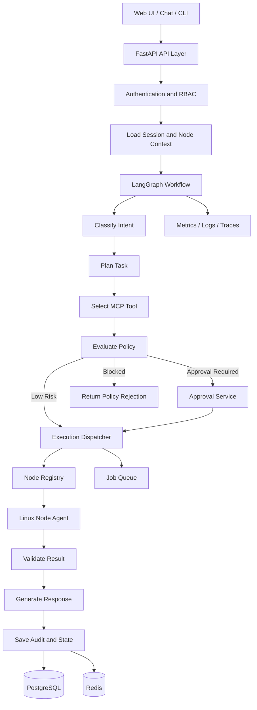

# NodePilot Control Plane

> Central orchestration, policy, approval, and audit service for the NodePilot platform.


## Overview

The NodePilot Control Plane is the central intelligence and coordination service of NodePilot.

It receives administration requests, authenticates the user, loads workflow context, uses LangGraph to classify and plan the task, selects an MCP tool, evaluates security policies, pauses for approval when required, dispatches the request to a Linux node agent, validates the result, and stores a complete audit record.

This repository contains the Windows-side or centralized backend service. It does not directly expose unrestricted shell execution.

## Responsibilities

- Authentication and user session handling
- Role-based access control
- LangGraph workflow orchestration
- Intent classification and task planning
- MCP gateway and tool registry
- Tool and node authorization
- Risk classification and policy evaluation
- Human approval workflows
- Linux node registration and heartbeat tracking
- Task dispatch and execution status
- Workflow checkpoint persistence
- Audit logging
- Result validation and response generation
- Metrics, logs, traces, retries, and error handling

## Architecture



## Technology Stack

### Core Backend

- Python 3.12+
- FastAPI
- Uvicorn
- Pydantic
- SQLAlchemy
- Alembic

### Agent Orchestration

- LangGraph
- LangChain
- MCP SDK
- Mistral, Llama, or Nemotron
- Optional embedding and retrieval service

### Data and Messaging

- PostgreSQL for durable state, users, nodes, approvals, and audit records
- Redis for sessions, cache, rate limits, heartbeat state, and temporary workflow data
- Redis Streams, RabbitMQ, or NATS for long-running jobs
- Object storage for reports and diagnostic artifacts

### Security

- OIDC or JWT-based authentication
- RBAC
- Node-level and tool-level permissions
- Signed requests or mutual TLS
- Approval gates
- Secret redaction
- Rate limiting
- Audit logging

### Observability

- Prometheus
- Grafana
- Loki
- OpenTelemetry
- LangSmith
- Structured JSON logging

### Quality and CI/CD

- Pytest
- Ruff
- Black
- MyPy
- Bandit
- pip-audit
- Trivy
- Pre-commit
- Docker
- GitHub Actions

## Planned LangGraph Workflow

```text
START
  |
  v
authenticate_user
  |
  v
load_session_context
  |
  v
classify_intent
  |
  v
plan_task
  |
  v
select_tool
  |
  v
evaluate_policy
  |
  +-----------------------------+
  | safe                        | approval required
  v                             v
dispatch_tool              request_approval
  |                             |
  |                             v
  |                       wait_for_decision
  |                             |
  +-------------<---------------+
  |
  v
validate_result
  |
  v
generate_response
  |
  v
save_audit_and_state
  |
  v
END
```

## Planned Repository Structure

```text
nodepilot-control-plane/
├── app/
│   ├── api/
│   │   └── v1/
│   ├── agents/
│   │   ├── nodes/
│   │   ├── prompts/
│   │   └── state/
│   ├── core/
│   ├── database/
│   ├── mcp/
│   ├── models/
│   ├── schemas/
│   ├── security/
│   ├── services/
│   └── main.py
├── tests/
│   ├── unit/
│   ├── integration/
│   └── e2e/
├── scripts/
├── docs/
├── migrations/
├── .github/workflows/
├── .env.example
├── Dockerfile
├── docker-compose.yml
├── pyproject.toml
└── README.md
```

## Planned API Areas

```text
/api/v1/auth
/api/v1/chat
/api/v1/workflows
/api/v1/nodes
/api/v1/tools
/api/v1/approvals
/api/v1/audit
```

Platform endpoints:

```text
/health
/ready
/metrics
/version
```

## Current Development Status

**Current phase: Repository initialization**

| Component | Status |
|---|---|
| Repository created | Completed |
| README and architecture | Completed |
| FastAPI project skeleton | Started |
| Configuration management | Planned |
| Health and readiness endpoints | Started |
| PostgreSQL integration | Planned |
| Redis integration | Planned |
| Node registry | Planned |
| MCP tool registry | Planned |
| LangGraph state and workflow | Started |
| Policy engine | Planned |
| Approval service | Planned |
| Audit service | Planned |
| Telemetry | Planned |
| CI/CD | Planned |

## Roadmap

### Milestone 1 — Service Foundation

- Create Python package structure
- Add configuration with Pydantic settings
- Add structured logging
- Implement `/health`, `/ready`, and `/version`
- Add Ruff, MyPy, Pytest, and pre-commit
- Add Dockerfile and local Docker Compose
- Add basic GitHub Actions workflow

### Milestone 2 — Persistence and Node Registry

- Configure PostgreSQL and Alembic
- Configure Redis
- Add node database model
- Implement node registration
- Implement node heartbeat
- Add online, degraded, and offline node states
- Add request IDs and standard error responses

### Milestone 3 — MCP Gateway

- Add MCP tool metadata model
- Implement tool registry
- Add parameter validation
- Implement node-agent client
- Normalize tool responses
- Add timeouts, retries, and idempotency

### Milestone 4 — LangGraph Orchestration

- Define workflow state
- Implement intent classifier
- Implement task planner
- Implement tool selector
- Implement policy node
- Implement execution and validation nodes
- Add PostgreSQL workflow checkpoints
- Add failure and retry branches

### Milestone 5 — Security and Approvals

- Add user and role models
- Implement RBAC
- Add tool and node permissions
- Implement risk classification
- Add approval request and continuation flow
- Add policy-blocked operation handling
- Add complete audit events

### Milestone 6 — Production Readiness

- Add queue workers
- Add Prometheus metrics
- Add OpenTelemetry traces
- Add Grafana and Loki integration
- Add integration and end-to-end tests
- Add container scanning
- Add staging deployment workflow

## Initial Development Target

The first working vertical slice should support:

1. Registering one Ubuntu node.
2. Receiving a natural-language health request.
3. Selecting `system.health`.
4. Executing the tool on the node agent.
5. Returning a structured result.
6. Saving an audit record.

## Local Development

Planned setup:

```bash
python -m venv .venv
```

Windows:

```bat
.venv\Scripts\activate
```

Install dependencies:

```bash
pip install -e ".[dev]"
```

Start dependencies:

```bash
docker compose up -d postgres redis
```

Run the application:

```bash
uvicorn app.main:app --host 0.0.0.0 --port 8080 --reload
```

Run tests:

```bash
pytest
```

Run quality checks:

```bash
ruff check .
black --check .
mypy app
```

## Security Principles

- The control plane must never send arbitrary shell commands supplied directly by the user.
- All operations must map to registered tools.
- Every tool must declare parameters, permissions, timeout, risk level, and approval requirements.
- Inputs and outputs must be validated.
- Secrets must not appear in prompts, logs, or audit payloads.
- Critical operations must be blocked by default.
- Every policy decision and execution must be auditable.

## Project Status Disclaimer

This repository is under active development. Authentication, authorization, transport security, audit persistence, and production deployment are not yet complete.
