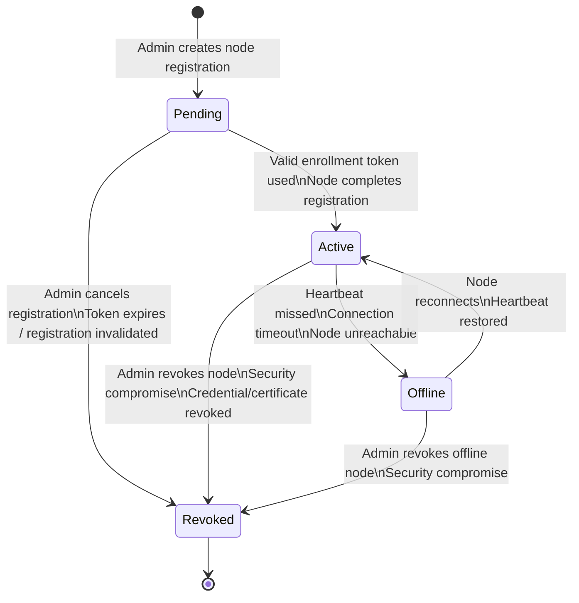
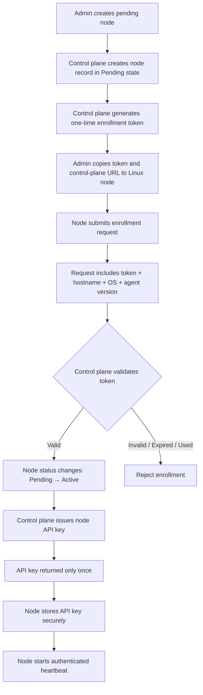

# Node Authentication Architecture

## 1. Roles & Responsibilities
- Admin: Complete Access to the node for his organization , Add node , delete node , revoke node , Update certifite , Update the access 
- Control plane: Control the linux machine ,plans the execution of the task, Send the task to the node and result is shown in the web console 
- Node: Execute the command on the node , Send the data to the control plane and waiting for the next command from the control plane

## 2. Node Lifecycle
Pending → Active → Offline → Revoked

## 3. Credential Types

| Credential                   | Purpose                                                               |                                    Lifetime | Storage                                                                                                                                      |
| ---------------------------- | --------------------------------------------------------------------- | ------------------------------------------: | -------------------------------------------------------------------------------------------------------------------------------------------- |
| Enrollment token             | Allows a new Linux node to complete its initial one-time registration | 10–15 minutes or until first successful use | Hashed on the control plane; entered temporarily on the Linux node                                                                           |
| Node API key                 | Authenticates normal requests from an enrolled Linux node             | 90 days initially, or until rotated/revoked | Hashed on the control plane; encrypted or permission-protected on the Linux node                                                             |
| Node certificate             | Identifies the Linux node during mutual TLS communication             |                           90 days initially | Certificate fingerprint, serial number and expiry stored on the control plane; certificate and private key stored securely on the Linux node |
| Request-signing secret       | Generates HMAC signatures for request integrity and replay protection | 90 days initially, or until rotated/revoked | Encrypted or hashed where applicable on the control plane; stored securely on the Linux node                                                 |
| Control-plane CA certificate | Allows Linux nodes to verify certificates issued by GraphBash         |             Long-lived, typically 1 years | Public CA certificate stored on both the control plane and Linux nodes                                                                       |
| Control-plane CA private key | Signs node certificates during enrollment and renewal                 |         Long-lived with controlled rotation | Stored only on the control plane in protected secret storage; never exposed to users or nodes                                                |

## 4. Expiry and Rotation Rules

### Enrollment Token

* The enrollment token expires 10–15 minutes after creation.
* The token can be used only once.
* The token is associated with one specific Node ID.
* The control plane stores only a hash of the token.
* The token is invalidated immediately after successful node enrollment.
* Expired, reused or revoked tokens must be rejected.
* The admin can cancel a pending registration, which immediately invalidates its token.
* A new token must be generated if the previous token expires before enrollment.

### Node API Key

* Each Linux node receives its own unique API key.
* The complete API key is returned only once during enrollment or rotation.
* The control plane stores only a secure hash of the API key.
* The Linux node stores the API key in a protected configuration or secret file.
* The API key should initially expire after 90 days.
* The API key must be rotated before expiry.
* The admin can manually rotate the API key at any time.
* Rotating the API key immediately invalidates the previous key.
* The API key must be revoked if:

  * The node is compromised.
  * The key is exposed.
  * The node is removed from GraphBash.
  * Suspicious authentication activity is detected.
* Requests using an expired, revoked or incorrect API key must be rejected.
* API keys must never appear in logs, error responses or audit records.

### Node Certificate

* The node certificate should initially have a 90-day validity period.
* The Linux node generates its private key locally.
* The node private key must never be sent to or stored on the control plane.
* The control plane stores:

  * Certificate fingerprint
  * Certificate serial number
  * Certificate expiry
  * Issuing CA
  * Revocation status
* Certificate renewal should begin approximately 15–30 days before expiry.
* Renewal should require the node to authenticate using its existing valid certificate and API credentials.
* The old certificate should remain valid only during a short controlled renewal window.
* A certificate must be revoked if:

  * The Linux node is compromised.
  * The private key may have been exposed.
  * The node is permanently removed.
  * The certificate identity does not match the registered Node ID.
* Expired, revoked or untrusted certificates must be rejected during the TLS handshake.
* A revoked node must not become active again simply by presenting an old certificate.

### Request-Signing Secret

* Each node should receive a unique request-signing secret.
* The secret is used to generate HMAC signatures for authenticated requests.
* The secret should initially expire after 90 days.
* It should normally be rotated together with the node API key.
* During controlled rotation, the previous and new secrets may both be accepted for a short overlap period.
* The previous secret must be permanently invalidated after the overlap period.
* The secret must be revoked immediately if request signatures appear compromised.
* Request-signing secrets must never be logged or returned in error responses.

### Certificate Authority

* The GraphBash Certificate Authority should initially have a validity period of 1–3 years.
* The CA private key must be stored only in protected control-plane secret storage.
* Access to the CA private key must be restricted to the certificate-issuance service.
* CA rotation must begin well before expiry.
* During CA rotation, nodes may temporarily trust both the previous and new CA certificates.
* Once all active node certificates are issued by the new CA, the old CA should be removed from the trust store.
* A suspected CA private-key compromise requires immediate certificate revocation and re-enrollment of affected nodes.

## 5. Recommended Initial Configuration

| Item                            |         Initial value |
| ------------------------------- | --------------------: |
| Enrollment token validity       |            15 minutes |
| Enrollment token usage          |            Single use |
| API-key validity                |               90 days |
| Request-signing secret validity |               90 days |
| Node certificate validity       |               90 days |
| Certificate renewal window      | 30 days before expiry |
| Request timestamp tolerance     |             5 minutes |
| Nonce retention period          |    At least 5 minutes |
| Credential rotation overlap     |      Maximum 24 hours |
| CA certificate validity         |             1 years |

## 5. Registration Flow
1. Admin creates pending node → gets enrollment token
2. Node submits token + hostname/OS/agent version
3. Control plane validates token, node → Active
4. Control plane issues API key (returned once)
5. Node stores key, begins authenticated heartbeat

